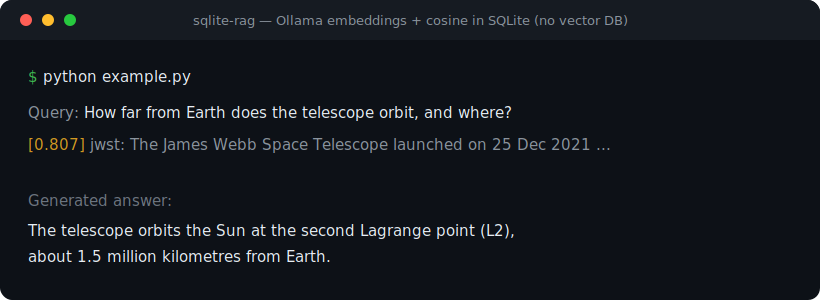

# sqlite-rag

**Minimal RAG: Ollama embeddings + cosine similarity in SQLite. No vector database. ~150 lines, standard library only.**



Most RAG stacks pull in a vector database (Chroma, Pinecone, Qdrant, FAISS), a
web framework, and a dozen dependencies. For small-to-medium corpora you don't
need any of that. This is the whole thing: embeddings come from a local
[Ollama](https://ollama.com) server, vectors and text live in one SQLite file,
and search is plain cosine similarity in Python.

## Why

- **Zero dependencies** — pure Python standard library (`sqlite3`, `urllib`, `json`, `math`).
- **One file, readable in one sitting** — easy to audit, fork, and embed in another project.
- **Local & private** — nothing leaves your machine.
- **Portable index** — the whole knowledge base is a single `.db` file you can copy around.

## Quickstart

```bash
ollama pull nomic-embed-text        # embedding model
python example.py
```

### Example run (real output)

```text
Query: How far from Earth does the telescope orbit, and at which point?
  [0.807] jwst: The James Webb Space Telescope launched on 25 December 2021 ...

Generated answer:
  The telescope orbits the Sun at the second Lagrange point (L2),
  about 1.5 million kilometres from Earth.
```

## Usage

```python
from sqlite_rag import RAG

rag = RAG("mydocs.db")
rag.ingest_file("notes.md")                 # or rag.ingest("some text", source="x")
for hit in rag.search("how do I reset it?", k=4):
    print(hit["score"], hit["source"], hit["text"][:80])
```

## How it works

1. **Ingest** — text is split into overlapping chunks; each chunk is embedded via
   Ollama's `/api/embeddings` and stored in SQLite together with its vector (as JSON).
2. **Search** — the query is embedded and compared against every stored vector with
   cosine similarity, computed in Python; the top-k chunks are returned.

That's it. No index structures, no ANN — a linear scan is plenty for thousands of
chunks and keeps the code trivial to understand.

> **nomic-embed-text detail:** the model expects task prefixes. This library adds
> `search_document: ` to stored chunks and `search_query: ` to queries automatically —
> forgetting these is a common cause of poor recall.

## Configuration (env vars)

| Variable | Default |
|---|---|
| `OLLAMA_URL` | `http://127.0.0.1:11434` |
| `EMBED_MODEL` | `nomic-embed-text` |
| `CHAT_MODEL` (example only) | `qwen2.5:7b` |

## Limits (honest)

- Linear scan: fine up to ~tens of thousands of chunks, then add an ANN index.
- Naive fixed-size chunking — swap in your own splitter if structure matters.
- No re-ranking; add a cross-encoder if you need higher precision.

## License

MIT
